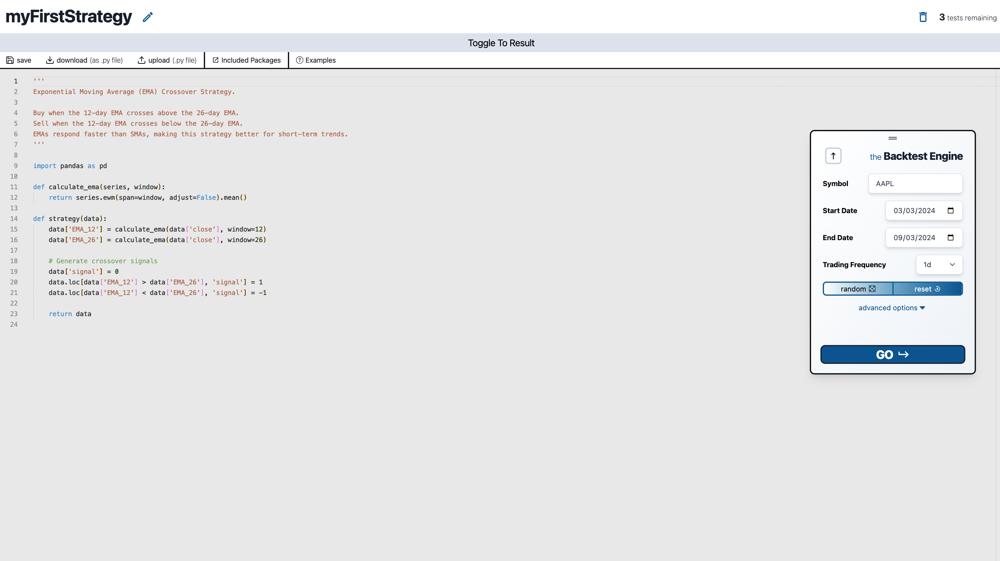
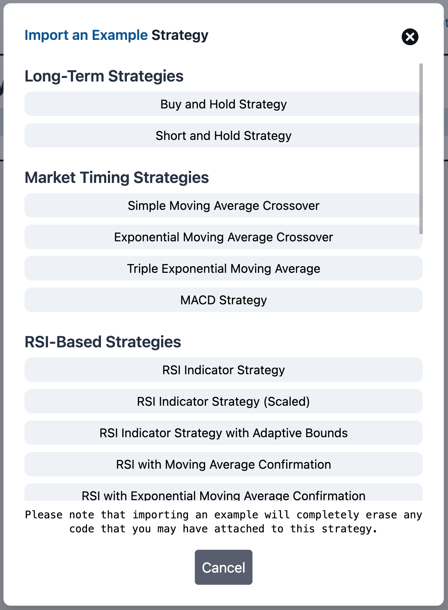

<h1 align="center">
    
    uBacktest
</h1>

<div align="center">
    <a href="https://ubacktest.com">uBacktest.com</a> &middot
    <a  href="https://docs.ubacktest.com">Documentation</a> &middot
    <a href="https://meehansoftware.com">Meehan Software Group</a>
</div>

<br>

<div align="center">
  
</div>

<div align="center">
  Created and maintained by <a href="https://github.com/therealhackmeehan">Jack Meehan</a>.
</div>

## What is uBacktest?

[**uBacktest.com**](https://uBacktest.com) is a web platform for evaluating algorithmic trading strategies against real historical market data—helping you move from idea → validation → (optionally) live-trading readiness.

## Why uBacktest?

<table>
    <td>
      <div>
        <h4>🚀 Code with Python and Pandas</h3>
        <p>No need to learn a new scripting language—use full-powered Python and Pandas immediately.</p>
      </div>
      <div>
        <h4>🤖 Machine & Deep Learning Ready</h3>
        <p>Preloaded with scikit-learn, PyTorch, TensorFlow, and more.</p>
      </div>
      <div>
        <h4>📚 Docs & Examples</h3>
        <p>Jump in instantly with built-in examples—just press <strong>Go</strong>.</p>
      </div>
      <div>
        <h4>🔄 Import & Export Scripts</h3>
        <p>Write code anywhere, then bring it into uBacktest with seamless execution.</p>
      </div>
    </td>
    <td width="50%">
      <div>
        <h4>📈 Stock Data Included</h3>
        <p>Select a ticker and date range—no costly feeds or local setup required.</p>
      </div>
      <div>
        <h4>💾 Save & Share Strategies</h3>
        <p>Track and refine your trading ideas—or share them with others.</p>
      </div>
      <div>
        <h4>🔧 Fully Customizable Backtesting</h3>
        <p>Control stock, date range, trading costs, and more for tailored results.</p>
      </div>
    </td>
</table>

## Getting Started

All users (including the free tier) need an account so strategies can be saved and reused.  
After signing up:

1. Open the **Strategy Editor**
2. Click **+ New** to create a strategy
3. Name it
4. You'll start with a template “buy-and-hold” strategy

From there, you can modify or build entirely new strategies using Python.

## How It Works (For the Nerds)

The uBacktest engine works as follows:

1. Retrieves the selected historical stock data via API
2. Injects the cleaned and formatted dataset into your `strategy()` function
3. Executes python code inside a secure [Judge0](https://judge0.com) sandbox
4. Ensures the strategy outputs a valid, day-by-day series of trading signals

Once execution is complete, the Node.js backend processes the results by iterating through the generated signals and producing:

- Chart-ready time series
- Performance metrics
- Risk and robustness analytics

Historical price data is sourced from a paid, professional market data provider.

## Tech Stack

uBacktest uses:

- 🐝 [**Wasp**](https://wasp.sh) — unified full-stack architecture
- 🟩 **Node.js** — backend API + server logic
- ⚛️ **React** + 🎨 **Tailwind CSS** — frontend UI
- 🐘 **PostgreSQL** (via Prisma ORM) — database + schema management
- 💳 **Stripe** — payments and subscription billing
- 🚀 **Fly.io** — hosting & deployment
- 🧪 **Playwright** — end-to-end testing
- 🔄 **GitHub Actions** — CI/CD pipeline

## The 10,000-Foot How-To

_The most accurate, up-to-date guide is always in the  
👉 **[uBacktest Docs](https://docs.ubacktest.com)**_

Every trading strategy must define:

```python
def strategy(data):

    # add a column of buy/sell signals here!

    return data
```

The returned DataFrame must contain a `signal` column (case-insensitive).
You may add as many helper columns as you want.

Example “buy-and-hold” strategy:

<div align=center>
  
</div>

You can use indicators, statistical rules, ML models, deep learning, or anything Python supports.

See all examples in the docs.

<div align=center>

</div>

## Usage Terms

This repository is licensed under:

### **Creative Commons Attribution–NonCommercial–NoDerivatives 4.0 (CC BY-NC-ND 4.0)**

✔️ **Permitted**

- Viewing the source
- Linking to this repo
- Educational study

❌ **Not permitted**

- Commercial use
- Redistribution
- Modification or derivatives
- Integration into software

For additional rights: **[support@ubacktest.com](mailto:support@ubacktest.com)**

## Repository Structure

### **/app**

Main application code (UI + server + database schema).
Uses a vertical feature-based architecture.

### **/test**

Playwright end-to-end tests.

### **/.github**


GitHub Actions workflows.

<div align="center">
    
</div>

<div align="center">
  <strong>© 2025 Meehan Software Group, LLC. All rights reserved.</strong>
</div>
